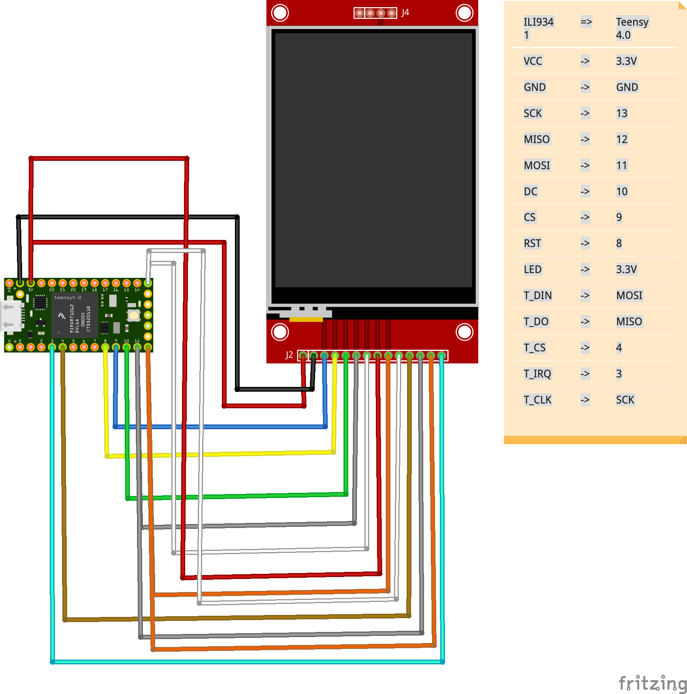

# t4-example
Examples for Teensy 4

## ILI9341
Examples using the ILI9341 display were tested with the Teensy 4.0 and the ILI9341 display. Following hardware connections were used:

ILI9341 | -> | Teensy 4.0
----|----|-----
VCC | -> | 3.3V
GND | -> | GND
SCK | -> | 13
MISO | -> | 12
MOSI | -> | 11
DC | -> | 10
CS | -> | 9
RST | -> | 8
LED | -> | 3.3V
T_DIN | -> | MOSI
T_DO| -> | MISO
T_CS | -> | 4
T_IRQ| -> | 3
T_CLK| -> | SCK

### Arduino examples from these libraries were used:
- [ILI9341_T4](https://github.com/vindar/ILI9341_T4)
- [TFT_eSPI](https://github.com/Bodmer/TFT_eSPI)
- [Adafruit_ILI9341](https://github.com/adafruit/Adafruit_ILI9341)

### Micropython examples use these libraries:
- [micropython-ili9341](https://github.com/russhughes/micropython-ili9341)
- [nano-gui](https://github.com/peterhinch/micropython-nano-gui)

### CircuitPython examples use these libraries:
- [Adafruit CircuitPython ILI9341](https://github.com/adafruit/Adafruit_CircuitPython_ILI9341)